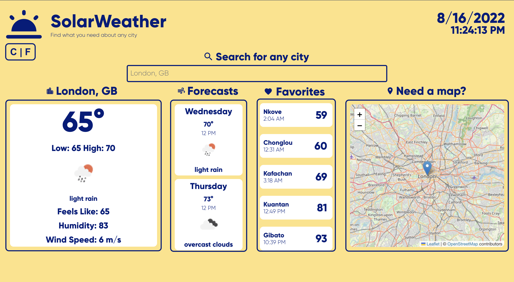

# 🌥 SolarWeather

SolarWeather is a website you can use to find the weather data you need for any city in the world




## 🔐 Installation

Use the package manager [pip](https://pip.pypa.io/en/stable/) to install foobar.

In the project directory, you can run:
```bash
npm start
```
Runs the app in the development mode.
Open http://localhost:3000 to view it in your browser.

The page will reload when you make changes.
You may also see any lint errors in the console.

## 🎬 Usage

You can view the website [here](https://solarweather.netlify.app/)

## 🏅 Features
- Can search for the weather data of any city
- Displays the temperature of any city
- Displays the date and current time
- Displays the future forecast over the next 5 days for searched city
- Fahrenheit to Celsius converter

## 💻 Technologies

- React.js
- HTML
- CSS
- OpenWeatherMap API
- Leaflet

## 🧑‍💻 Team

- Just a solo project so far, but looking for others to collaborate with! Dm me on [discord](https://discord.com) @ hud*#7135.

## License
[MIT](https://choosealicense.com/licenses/mit/)
